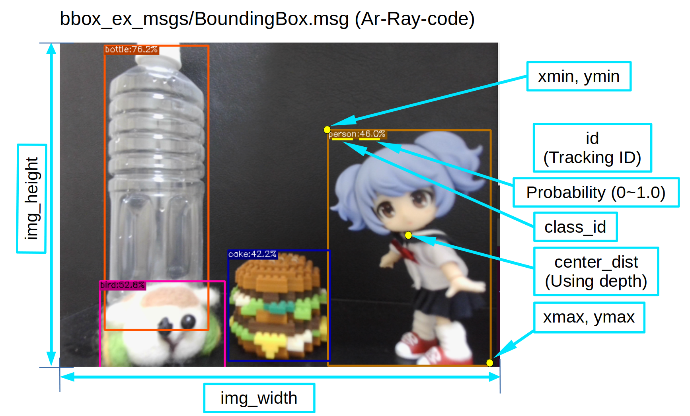

# bbox_ex_msgs

Extended message for [darknet_ros_msgs](https://github.com/leggedrobotics/darknet_ros/tree/master/darknet_ros_msgs).

## msgs/BoundingBoxes.msg

- header (std_msgs/Header)
- image_header (std_msgs/Header)
- bounding_boxes (BoundingBox[])

## msgs/BoundingBox.msg

- probability (float32)
- xmin (uint16)
- ymin (uint16)
- xmax (uint16)
- ymax (uint16)
- id (uint16)
- img_width (uint16)
- img_height (uint16)
- center_dist (uint32)
- class_id (string)

